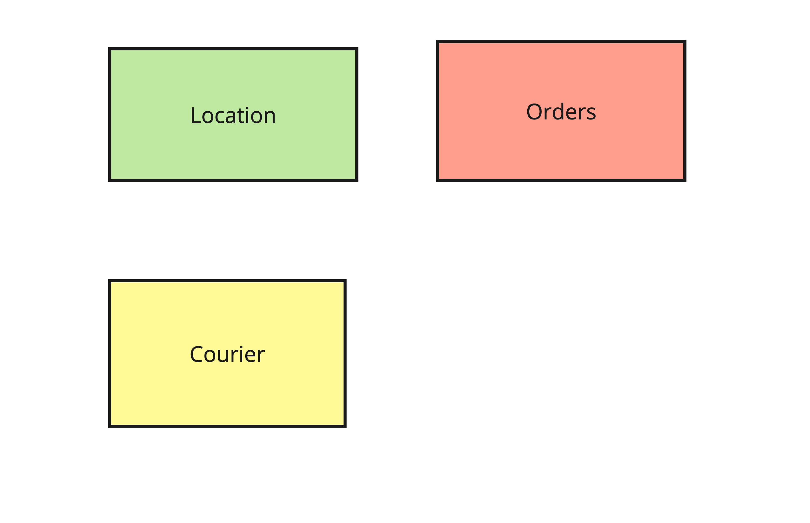
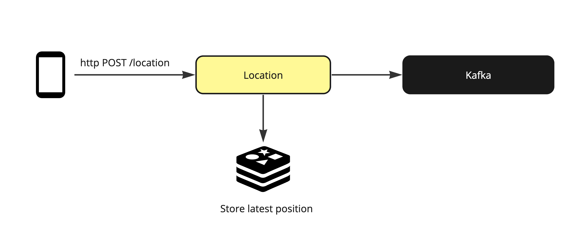

### Test Go project for Dymas

#### Architecture:
There are three main domains: 
- **Location**: _This is responsible for any geo operations, 
  such as storing the last gep position of a courier._
- **Courier**: This is responsible for managing the couriers itself, 
  are they available how many orders they have been completed and so on.
- **Orders**: This is responsible for orders and its management

Flow to track the last courier geo position:

